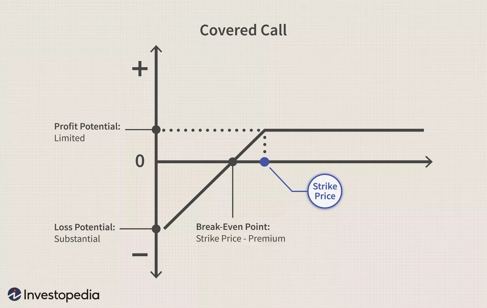

# Covered Calls

This is a strategy combining the purchase of a digital asset (e.g. Bitcoin) and selling out of the money call options to sell that asset. Typically an investor would deposit tokens into a vault and it will accrue yield from the options premium. The protocol will automatically create and sell call options at a price calculated by an algorithm based on market conditions.

When to Use:&#x20;

* best in bearish to mild bull markets
* In a bearish scenario, the investor loses less than from just holding the asset (he receives the option premium)
* In a bullish scenario, the investor forgives part of the upside from just holding the asset.

Risks:

* If the price of the asset declines too much, the investor will incur potential losses, that may not be covered by the profit from option premiums
* If the price of the asset goes up and reaches the option strike price, the investor will be forced to sell it, and therefore incur an opportunity cost from not keeping the asset.

Vault strategy:&#x20;

Weekly European Call Options are sold every Friday at an auction. The strike price is selected in order to achieve a delta of less than 0.2. This is on order to minimise the likelihood of the options expiring at the money.

\

<figure><figcaption>
Covered Call Payout Chart. Credit: Investopedia.
</figcaption></figure>
